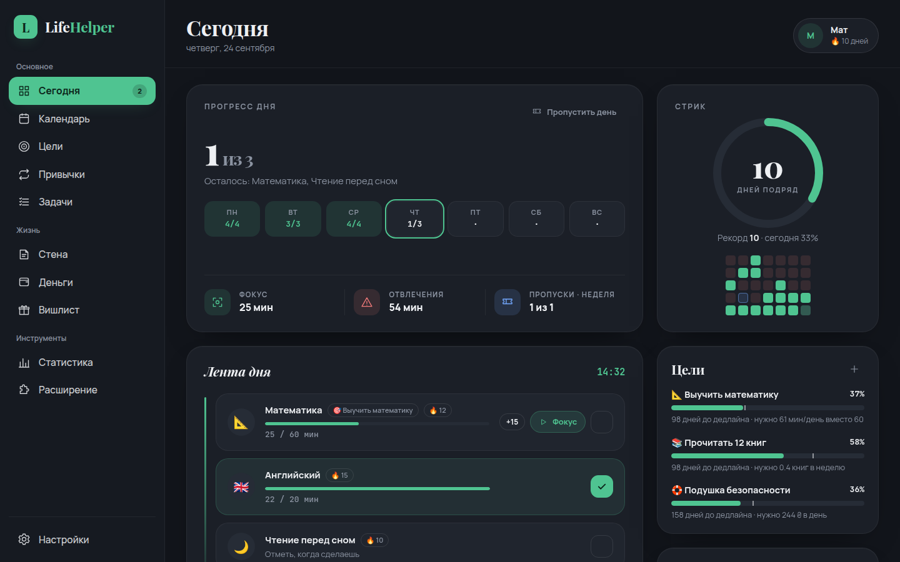
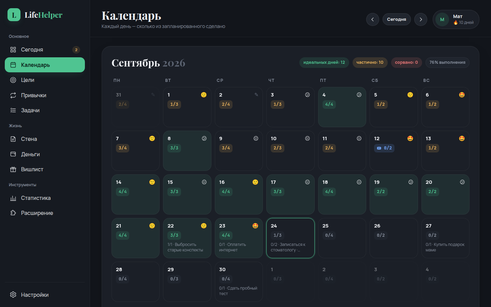
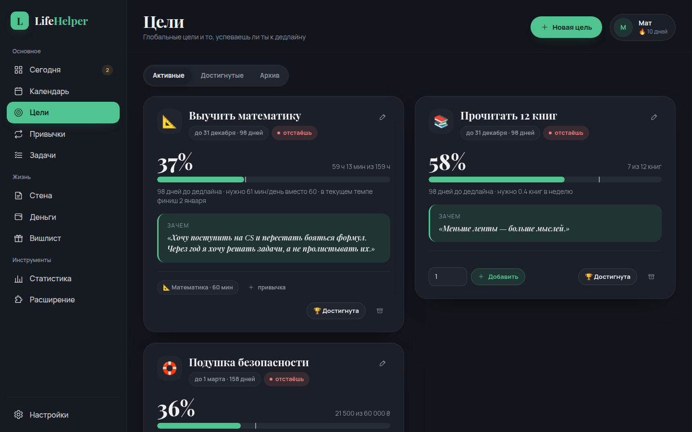
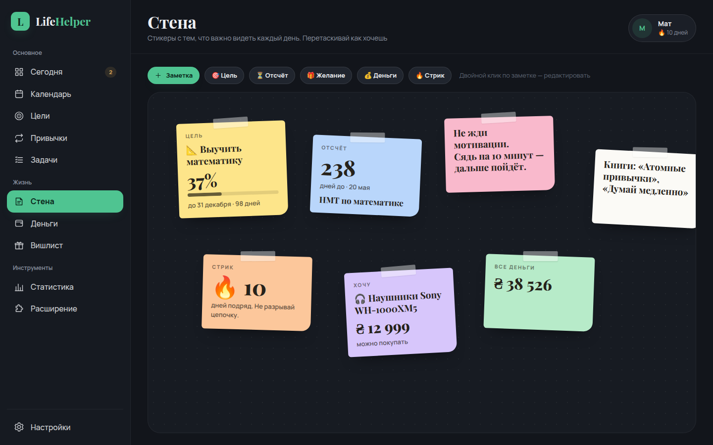
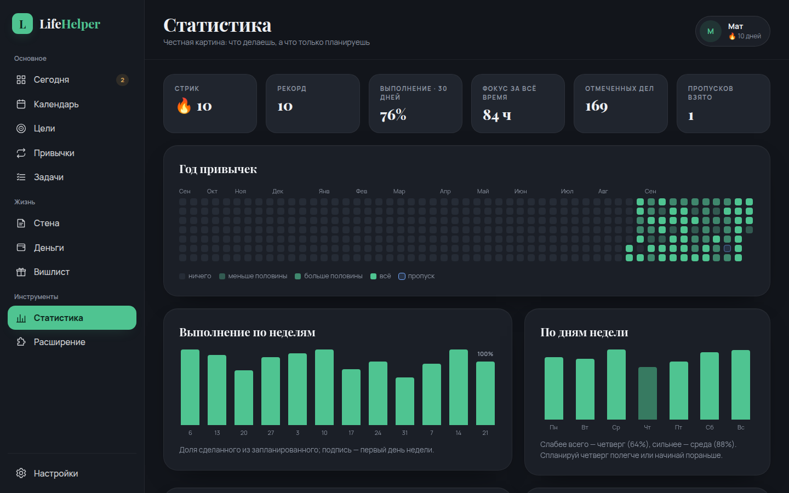
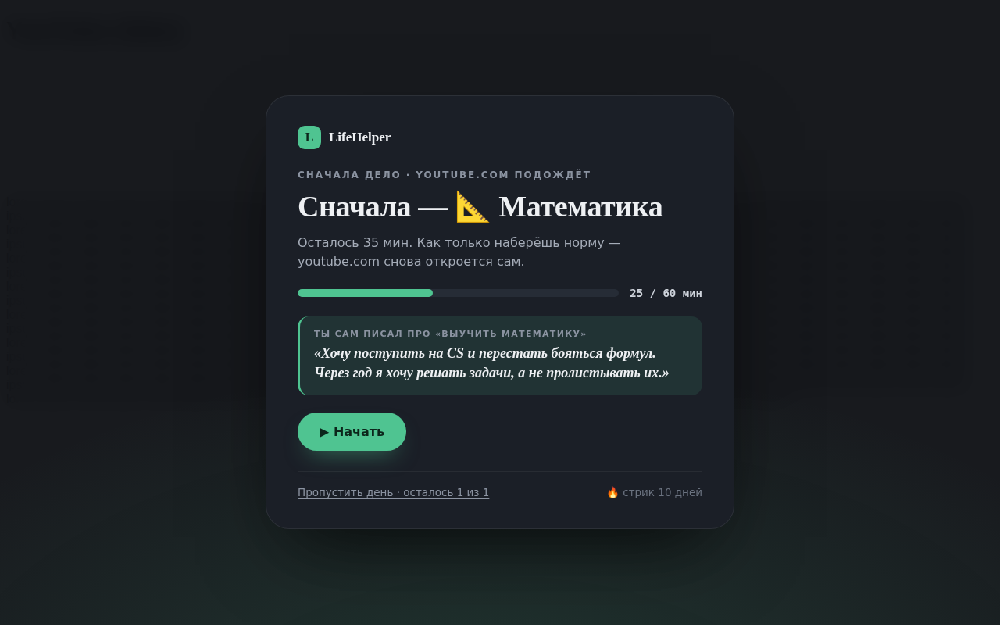
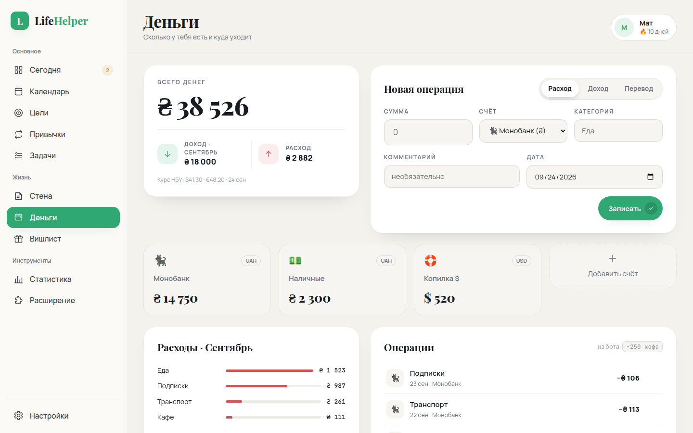
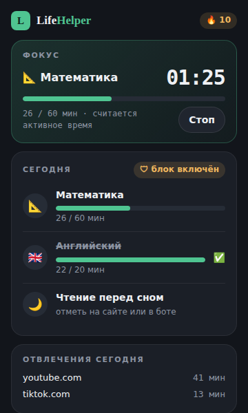

# LifeHelper

Личная система «вся жизнь на одной стене»: глобальные цели → ежедневная норма → календарь 0/1 → вечерний чек-лист в Telegram → расширение Chrome, которое не пускает на YouTube, пока не сделано главное.



## Из чего состоит

| Часть | Что делает |
|---|---|
| **Сайт** | Сегодня, календарь, цели с расчётом темпа, привычки, задачи, стена стикеров, деньги, вишлист, статистика. Тёмная и светлая тема, работает с телефона. |
| **Telegram-бот** | Утром — план дня, в 19:00 — напоминание, вечером — чек-лист с галочками и настроением, в воскресенье — итоги недели. Вход на сайт тоже через него. |
| **Chrome-расширение** | Закрывает отвлекающие сайты экраном «Сначала — Математика», по кнопке «Начать» ведёт на сайт для занятий и считает время, пока вкладка с учёбой на экране (видео-уроки — целиком). Набрал норму — привычка отмечается сама. |

### Главные фишки

- **Цель → норма → темп.** «Выучить математику до 31 декабря» + «60 мин в день». Сайт считает, сколько всего нужно, где ты должен быть сегодня (метка на прогресс-баре), отстаёшь ли, и когда закончишь в текущем темпе.
- **Календарь 0/1.** Каждый день — сколько из запланированного сделано: зелёный, жёлтый, красный, синий (пропуск). Клик по дню — отметить задним числом, настроение, заметка.
- **Стрик 🔥** общий и по каждой привычке, рекорд, годовая тепловая карта.
- **Пропуск дня** — по умолчанию 1 в неделю (настраивается). Замораживает стрик, а не сжигает. Перед подтверждением — честный экран с последствиями, посчитанными по твоим данным, и 20 секунд на подумать:
  > 📐 «Выучить математику»: сегодня минус 34 мин. Чтобы успеть к 31 декабря, дальше придётся заниматься по 62 мин в день вместо 60. Ты и так уже отстаёшь на 1 ч 12 мин.
  > Если не наверстать — финиш сдвинется с 2 января на 3 января.
  > «Чтение перед сном»: 10 дней подряд. Цепочка замёрзнет.
  >
  > 💬 *Ты сам писал: «Хочу поступить на CS и перестать бояться формул»*
- **«Зачем мне это»** — у каждой цели. Показывается ровно тогда, когда хочется сдаться.
- **Автотаймер.** Зашёл на Khan Academy сам — фокус-сессия включилась без кнопок.
- **Отвлечения.** Сколько времени сегодня съели YouTube/TikTok/Instagram — на главной, в попапе расширения и в итогах недели.
- **Деньги.** Счета в разных валютах (курс НБУ подтягивается сам), расходы по категориям, динамика. Из бота: `-250 кофе`, `+15000 зарплата`.
- **Вишлист с правилом 7 дней** — купить можно только после «остывания»; видно, какой процент всех денег это съест.
- **Стена стикеров** — заметки, живые карточки целей, отсчёт до даты, стрик, баланс. Перетаскиваются мышкой или пальцем.
- **Быстрый ввод из Telegram** — любой текст боту = задача во «Входящих».
- **Экспорт** всех данных в JSON одной кнопкой.

| | |
|---|---|
|  |  |
|  |  |
|  |  |

## Почему не просто GitHub Pages

GitHub Pages умеет только статические страницы: там нельзя хранить данные, и боту негде работать 24/7. Поэтому:

- **код живёт на GitHub** (репозиторий можно сделать публичным — ни одного секрета в коде нет);
- **при каждом пуше** Cloudflare сам забирает код из GitHub и выкладывает его на **Cloudflare Workers** — бесплатно, без сервера, работает круглосуточно;
- данные лежат в **Cloudflare D1** (SQLite), бот получает сообщения через вебхук, расписание — Cron Triggers.

Бесплатного лимита (100 000 запросов в день) хватает с огромным запасом.

**Чужие не испортят статистику:** войти можно только через Telegram, и только с аккаунта владельца. Владельцем становится тот, кто первым вошёл после деплоя (или задай `OWNER_TELEGRAM_ID`).

## Запуск (≈10 минут, один раз)

### 1. Бот
1. В Telegram открой [@BotFather](https://t.me/BotFather) → `/newbot` → придумай имя.
2. Скопируй токен вида `123456789:AA...`. **Никогда не клади его в код или в репозиторий** — только в секреты Cloudflare.

### 2. Cloudflare подключается к GitHub
1. Зарегистрируйся на [dash.cloudflare.com](https://dash.cloudflare.com) (бесплатно).
2. **Workers & Pages → Create → Import a repository** → выбери `lifehelper`.
3. Команды оставь как есть: build `npm run build`, deploy `npx wrangler deploy`. Больше ничего настраивать не нужно: база D1 создастся при первом деплое сама, таблицы — при первом открытии сайта.

### 3. Секрет с токеном бота
**Workers & Pages → lifehelper → Settings → Variables and Secrets → Add**:

| Type | Name | Value |
|---|---|---|
| **Secret** | `TELEGRAM_BOT_TOKEN` | токен бота |
| Secret *(необязательно)* | `OWNER_TELEGRAM_ID` | твой числовой ID — узнать у [@userinfobot](https://t.me/userinfobot) |

Секреты переживают следующие деплои — задать их нужно один раз.

### 4. Деплой
**Deployments → Deploy** (или просто пуш в production-ветку — по умолчанию `main`; поменять можно в **Settings → Build → Branch control**). Адрес сайта — в **Settings → Domains & Routes**, вида `https://lifehelper.<поддомен>.workers.dev`.

<details>
<summary>Альтернатива: деплой через GitHub Actions</summary>

Если не хочешь подключать репозиторий к Cloudflare, можно деплоить из GitHub:
1. Cloudflare: **My Profile → API Tokens → Create Custom Token** с правами Account → Workers Scripts: Edit, D1: Edit, Account Settings: Read. Скопируй и **Account ID**.
2. GitHub: **Settings → Secrets and variables → Actions** → `CLOUDFLARE_API_TOKEN`, `CLOUDFLARE_ACCOUNT_ID`, `TELEGRAM_BOT_TOKEN`, (опц.) `OWNER_TELEGRAM_ID`.
3. Пуш в `main` или **Actions → CI / Deploy → Run workflow**.
</details>

### 5. Первый вход
Открой адрес → **Войти через Telegram** → в боте нажми **Start**. Готово: ты владелец, сайт пустит внутрь. Дальше:
1. **Цели → Новая цель**: «Выучить математику», дедлайн, «зачем», 60 минут в день, сайт для занятий.
2. **Настройки**: время утреннего/вечернего сообщения, часовой пояс, список отвлекающих сайтов.
3. **Настройки → Telegram → Тестовое сообщение** — проверить, что бот пишет.

### 6. Расширение Chrome
1. Скачай репозиторий (Code → Download ZIP) и распакуй.
2. Открой `chrome://extensions`, включи **Режим разработчика**.
3. **Загрузить распакованное расширение** → папка `extension`.
4. В открывшихся настройках укажи адрес сайта и нажми **Войти через Telegram**.

<p align="center"></p>

## Бот

| Команда | Что делает |
|---|---|
| `/today` | чек-лист на сегодня с галочками и настроением |
| `/stats` | стрик и темп по целям |
| `/week` | итоги недели |
| `/skip` | пропуск дня (с экраном последствий и 20 секундами) |
| `/login` | одноразовая ссылка для входа на сайт с телефона |
| `/wish Наушники 3500` | в вишлист |
| `/note текст` | стикер на стену |
| `-250 кофе` / `+15000 зарплата` | расход / доход |
| любой текст | задача во «Входящие» |

## Как считается время в расширении

Время идёт, пока открыт сайт из списка привычки (или вкладка, которую ты сам отметил «для учёбы») и эта вкладка на экране — активная в своём окне, окно не свёрнуто. Кликать не нужно: видео-уроки засчитываются целиком, можно параллельно писать конспект в другом окне. Клики и нажатия пишутся только в статистику. Если на экране сразу две учебные вкладки, время не удваивается.

Каждую минуту расширение отправляет накопленное на сайт; при обрыве связи ничего не теряется. Время на сайтах из блок-листа пишется отдельно — как «отвлечения».

## Локальная разработка

```bash
npm install
npm run dev              # API :8787 + сайт :5173, вход без Telegram (DEV_LOGIN=1)
node scripts/seed-demo.mjs   # демо-данные (перезаписывает ЛОКАЛЬНУЮ базу)
npm run typecheck
npm run build && npm test    # сквозной тест: вход, стрики, пропуски, бот, расширение, крон
```

Проверить бота локально с настоящим Telegram: положи `TELEGRAM_BOT_TOKEN` в `.dev.vars` и запусти `npm run bot:poll` (он временно снимает вебхук продакшена — потом нажми на сайте «Настройки → Telegram → Переподключить»).

Расширение локально: в настройках расширения укажи `http://localhost:8787` и вставь токен со страницы «Расширение».

## Устройство

```
worker/            Cloudflare Worker (TypeScript, Hono)
  api/             REST API: core (день/привычки/цели/задачи), life (деньги/вишлист/стена), system, ext, auth
  bot/             Telegram: вебхук, тексты и клавиатуры
  lib/progress.ts  ядро: расписание, стрики, пропуски, темп целей, текст «точно пропустить?»
  cron.ts          каждую минуту: утро, напоминание, вечер, итоги недели, курсы НБУ
web/               сайт (React + Vite), собирается в web/dist и раздаётся тем же воркером
extension/         Chrome MV3, без сборки: background.js, content.js (экран блокировки), popup, options
migrations/        схема D1
tests/             сквозной тест с фейковым Telegram
```

Резервная копия: **Настройки → Скачать всё (JSON)**. Кроме того, D1 хранит историю изменений (Time Travel) и позволяет откатить базу на любой момент последних дней.
